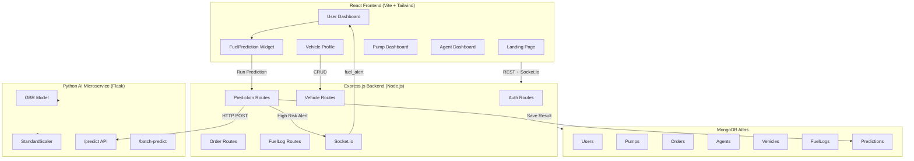
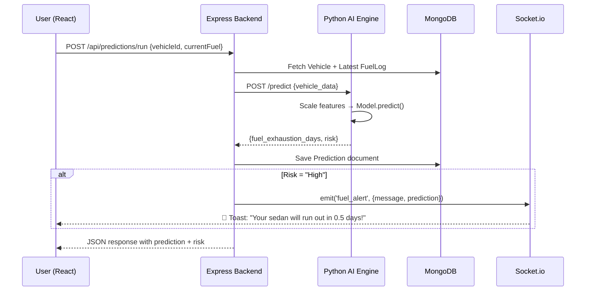
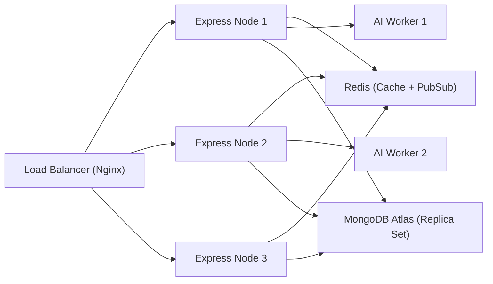

# FuelSense AI — Architecture & Deployment Guide

## 🏗️ System Architecture



---

## 📊 Database Schema Design

### Existing Collections

| Collection | Key Fields | Purpose |
|---|---|---|
| **Users** | name, email, password, phone, role | User authentication |
| **Pumps** | stationName, location (GeoJSON), fuelTypes, isActive | Fuel station registry |
| **Orders** | user, pump, agent, fuelType, amount, pricing, status, userLocation | Fuel delivery orders |
| **Agents** | name, pumpId, isAvailable, currentLocation, vehicleNumber | Delivery agents |
| **Requests** | userLocation, fuelType, amount, status, pumpId | Raw fuel requests |

### New AI Collections

| Collection | Key Fields | Purpose |
|---|---|---|
| **Vehicles** | user, vehicleType, fuelCapacityLiters, avgMileageKmpl, dailyTravelKm, highwayRatio, lastRefillDate | Vehicle profiles for AI predictions |
| **FuelLogs** | vehicle, user, fuelLevelLiters, source, loggedAt | Historical fuel level tracking |
| **Predictions** | user, vehicle, fuelExhaustionDays, riskLevel, riskColor, inputSnapshot, acknowledged | AI prediction results |

---

## 🔌 API Endpoints

### Authentication
| Method | Endpoint | Description |
|---|---|---|
| POST | `/api/auth/register` | Register user/pump/agent |
| POST | `/api/auth/login` | Login (returns JWT) |

### Vehicle Management (NEW)
| Method | Endpoint | Description |
|---|---|---|
| POST | `/api/vehicles` | Register a vehicle |
| GET | `/api/vehicles` | List user's vehicles |
| GET | `/api/vehicles/:id` | Get vehicle details |
| PUT | `/api/vehicles/:id` | Update vehicle |
| DELETE | `/api/vehicles/:id` | Remove vehicle |

### Fuel Logging (NEW)
| Method | Endpoint | Description |
|---|---|---|
| POST | `/api/fuel-logs` | Log current fuel level |
| GET | `/api/fuel-logs/:vehicleId` | Get logs for vehicle |
| GET | `/api/fuel-logs/:vehicleId/latest` | Get latest fuel level |

### AI Predictions (NEW)
| Method | Endpoint | Description |
|---|---|---|
| POST | `/api/predictions/run` | Run AI prediction (proxies to Python engine) |
| GET | `/api/predictions` | Get prediction history |
| GET | `/api/predictions/latest/:vehicleId` | Latest prediction for vehicle |
| PATCH | `/api/predictions/:id/acknowledge` | Mark alert as seen |

### AI Engine (Python — port 5001)
| Method | Endpoint | Description |
|---|---|---|
| POST | `/predict` | Single vehicle prediction |
| POST | `/batch-predict` | Fleet batch prediction |
| GET | `/health` | Service health check |

### Orders & Payments (existing)
| Method | Endpoint | Description |
|---|---|---|
| POST | `/api/orders` | Create fuel delivery order |
| GET | `/api/orders` | List orders |
| POST | `/api/payments/create-order` | Create Razorpay payment order |
| POST | `/api/payments/verify` | Verify payment |

---

## 🔄 Real-Time Inference Flow



---

## 📍 Real-Time Location Matching Logic

```
1. User opens app → browser Geolocation API → [lat, lng]
2. GET /api/pumps?lat=X&lng=Y → MongoDB $geoNear query (2dsphere index)
3. Client-side Haversine formula ranks pumps by distance
4. Nearest pump selected → distance used for delivery pricing
5. Pump markers displayed on Leaflet map with live distance labels
```

**Haversine Formula** (already implemented in `UserDashboard.jsx`):
```js
function haversine(lat1, lon1, lat2, lon2) {
    const R = 6371; // Earth radius in km
    const dLat = toRad(lat2 - lat1);
    const dLon = toRad(lon2 - lon1);
    const a = sin(dLat/2)² + cos(lat1) * cos(lat2) * sin(dLon/2)²;
    return R * 2 * atan2(√a, √(1-a));
}
```

---

## 🚀 Scalability Strategy

| Layer | Strategy | Implementation |
|---|---|---|
| **Frontend** | CDN + Static hosting | Vercel (already deployed) |
| **Backend** | Horizontal scaling | PM2 cluster mode / Kubernetes pods |
| **AI Engine** | Stateless workers | Gunicorn multi-worker / Docker replicas |
| **Database** | Replica set + sharding | MongoDB Atlas auto-scaling |
| **Real-time** | Redis adapter | Socket.io + Redis pub/sub for multi-node |
| **Caching** | Redis cache | Cache predictions for same vehicle within 1 hour |
| **Queue** | Bull/BullMQ | Async prediction jobs for fleet batch processing |



---

## 🖥️ AMD Acceleration Strategy

| Component | AMD Technology | Benefit |
|---|---|---|
| **Model Training** | ROCm + PyTorch | GPU-accelerated gradient boosting (future DL models) |
| **CPU Inference** | ZenDNN (AMD EPYC/Ryzen) | 2.5x faster inference with optimized GEMM |
| **scikit-learn** | AOCL-BLIS (AMD BLAS) | Optimized linear algebra on AMD CPUs |
| **Thread Optimization** | OpenMP thread pinning | `OMP_NUM_THREADS` + `GOMP_CPU_AFFINITY` |

---

## 🚀 Deployment Strategy

### Development
```bash
# 1. Generate dataset & train model
cd ai-engine
pip install -r requirements.txt
python dataset/generate_synthetic_data.py
python train_model.py

# 2. Start AI engine
python app.py  # → port 5001

# 3. Start backend
cd ../server
npm install && npm run dev  # → port 5000

# 4. Start frontend
cd ../client
npm install && npm run dev  # → port 5173
```

### Production
```bash
# AI Engine → Docker
docker build -t fuelsense-ai ./ai-engine
docker run -p 5001:5001 fuelsense-ai

# Backend → PM2
pm2 start server.js -i max --name fuel-rescue-api

# Frontend → Vercel
cd client && vercel --prod
```

### Environment Variables
```env
# server/.env
MONGO_URI=mongodb+srv://...
JWT_SECRET=your_secret_key
AI_ENGINE_URL=http://localhost:5001
RAZORPAY_KEY_ID=rzp_test_...
RAZORPAY_KEY_SECRET=...

# client/.env
VITE_API_URL=http://localhost:5000
```

---

## 🎯 Hackathon Demo Strategy

### Live Demo Script (5 min)
1. **Open app** → Show landing page + dark UI
2. **Register** → Create test user account
3. **Add Vehicle** → Go to `/vehicle-profile`, add a sedan with low fuel stats
4. **Run Prediction** → Click "Predict" on dashboard widget → Show 🔴 High Risk result
5. **Order Fuel** → Click "Order Emergency Fuel Now" → Complete mock payment
6. **Real-time** → Show pump dashboard receiving the order → Agent assignment → Delivery tracking

### Talking Points
- **Problem**: 68,000+ roadside breakdowns per year in India due to fuel starvation
- **Solution**: Proactive AI that predicts emergencies *before* they happen
- **Innovation**: First platform combining fuel prediction with instant delivery
- **Tech Stack**: MERN + Python ML + Socket.io real-time + AMD acceleration
- **AI Model**: Gradient Boosting Regressor with 3 risk levels, <1 day MAE
- **Scalability**: Microservice architecture, stateless AI workers, Redis caching
- **Market**: 300M+ registered vehicles in India, ₹12,000 Cr fuel delivery market

---

## 🔮 Future Expansion

| Feature | Description | Timeline |
|---|---|---|
| **Fleet Management** | Batch predictions for commercial fleets | v2 |
| **OBD-II Integration** | Real-time fuel data from vehicle sensors | v2 |
| **Predictive Maintenance** | Predict engine issues from driving patterns | v3 |
| **Route Optimization** | Suggest fuel-efficient routes | v2 |
| **EV Support** | Battery range prediction for electric vehicles | v3 |
| **Insurance Integration** | Risk-based insurance premiums | v3 |
| **City Partnership** | Municipal fleet management contracts | v3 |
